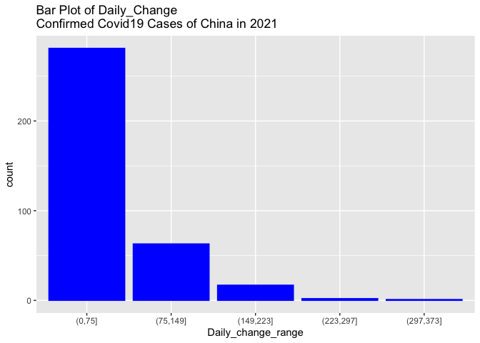
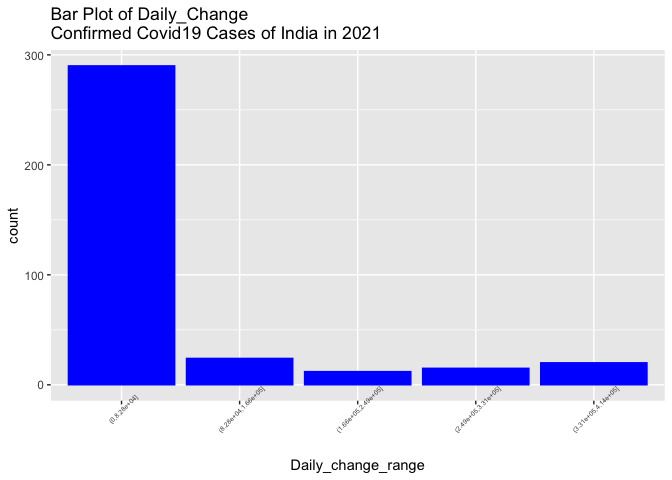
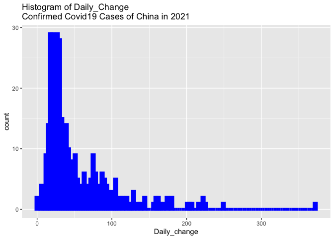
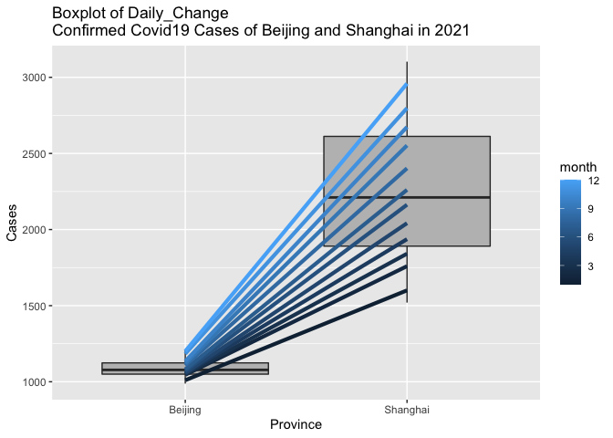
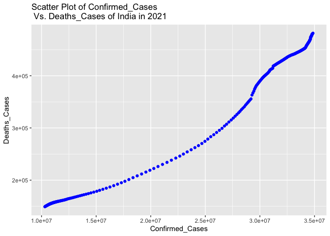

ST558\_project1
================
Li Wang
6/22/2022

write code using the rmarkdown::render function to output your .Rmd file
to a file called README.md.

``` r
rmarkdown::render("../ST558_project1/README.md",output_format = "github_document")
```

# Goal

My goal with this project is to create a vignette about contacting the
[COVID19 API](https://documenter.getpostman.com/view/10808728/SzS8rjbc)
using functions I create to query, parse, return well-structured data,
and then I will use the functions to obtain data from the API and do
some exploratory data analysis.

# Load Packages

To use the functions for interacting with the [COVID19
API](https://documenter.getpostman.com/view/10808728/SzS8rjbc), I used
the following packages:

``` r
library(httr)
library(jsonlite)
library(readr)
library(dplyr)
```

    ## 
    ## Attaching package: 'dplyr'

    ## The following objects are masked from 'package:stats':
    ## 
    ##     filter, lag

    ## The following objects are masked from 'package:base':
    ## 
    ##     intersect, setdiff, setequal, union

``` r
library(plyr)
```

    ## ------------------------------------------------------------------------------

    ## You have loaded plyr after dplyr - this is likely to cause problems.
    ## If you need functions from both plyr and dplyr, please load plyr first, then dplyr:
    ## library(plyr); library(dplyr)

    ## ------------------------------------------------------------------------------

    ## 
    ## Attaching package: 'plyr'

    ## The following objects are masked from 'package:dplyr':
    ## 
    ##     arrange, count, desc, failwith, id, mutate, rename, summarise,
    ##     summarize

``` r
library(tidyr)
library(ggplot2)
library(tidyverse)
```

    ## ── Attaching packages ─────────────────────────────────────── tidyverse 1.3.1 ──

    ## ✓ tibble  3.1.6     ✓ stringr 1.4.0
    ## ✓ purrr   0.3.4     ✓ forcats 0.5.1

    ## ── Conflicts ────────────────────────────────────────── tidyverse_conflicts() ──
    ## x plyr::arrange()   masks dplyr::arrange()
    ## x purrr::compact()  masks plyr::compact()
    ## x plyr::count()     masks dplyr::count()
    ## x plyr::failwith()  masks dplyr::failwith()
    ## x dplyr::filter()   masks stats::filter()
    ## x purrr::flatten()  masks jsonlite::flatten()
    ## x plyr::id()        masks dplyr::id()
    ## x dplyr::lag()      masks stats::lag()
    ## x plyr::mutate()    masks dplyr::mutate()
    ## x plyr::rename()    masks dplyr::rename()
    ## x plyr::summarise() masks dplyr::summarise()
    ## x plyr::summarize() masks dplyr::summarize()

``` r
library(lubridate)
```

    ## 
    ## Attaching package: 'lubridate'

    ## The following objects are masked from 'package:base':
    ## 
    ##     date, intersect, setdiff, union

# Write functions to query the data

## “By Country” endpoint

I write this function to interact with the “By Country” endpoint of the
[COVID19 API](https://documenter.getpostman.com/view/10808728/SzS8rjbc).

The following function can allow us to query the “country”,“status”,
“from”, and “to” modifications to return a specific data. The status
must be one of: confirmed, recovered, deaths.

``` r
# write a funtion to query the "country","status", "from", and "to" modifications to return a specific data.
covid19_data_by_country<- function(country,status,from,to){
  base<-"https://api.covid19api.com/country/"
  call1 <- paste(base,country,"/","status","/",status,"?","from","=",from, "&","to","=",to, sep="")
  by_country <- GET(call1)
  by_country_text <- content(by_country, "text")
  by_country_json <- fromJSON(by_country_text, flatten = TRUE)
  # Remove the column 4 to 5 which is non-meaningful
  covid19_by_country <- by_country_json[,-(4:5),drop=FALSE]
}
```

I query the “country” as “China”, the “status” as “confirmed”, the
“from” as “2021/01/01”, and “to” as “2021/12/31”, then I got the
data set of the COVID19 confirmed cases for china from “2021/01/01”
to“2021/12/31”.

``` r
# Query the data set "china_confirmed" with the COVID19 confirmed cases for china from "2021/01/01" to"2021/12/31".
china_confirmed <-covid19_data_by_country("china","confirmed","2021/01/01","2021/12/31")
# change the Date to ""%Y/%m/%d""
china_confirmed$Date <- format(as.POSIXct(china_confirmed$Date,format="%Y-%m-%dT%H:%M:%SZ"),format="%Y/%m/%d")
head(china_confirmed)
```

    ##   Country CountryCode Province   Lat    Lon Cases    Status       Date
    ## 1   China          CN   Shanxi 37.58 112.29   224 confirmed 2021/01/01
    ## 2   China          CN   Hainan  19.2 109.75   171 confirmed 2021/01/01
    ## 3   China          CN  Guangxi 23.83 108.79   264 confirmed 2021/01/01
    ## 4   China          CN    Henan 33.88 113.61  1299 confirmed 2021/01/01
    ## 5   China          CN Liaoning  41.3 122.61   359 confirmed 2021/01/01
    ## 6   China          CN  Ningxia 37.27 106.17    75 confirmed 2021/01/01

## “By Country Total” endpoint

I write this function to interact with the “By Country Total” endpoint
of the [COVID19
API](https://documenter.getpostman.com/view/10808728/SzS8rjbc).

The following function can allow us to query the “country”, “status”,
“from”, and “to” modifications to return a specific data. The status
must be one of: confirmed, recovered, deaths.

``` r
# write a function to query the "country","status", "from", and "to" modifications to return a specific data.
covid19_Country_Total<- function(country,status,from,to){
  base<-"https://api.covid19api.com/total/country/"
  call2 <- paste(base,country,"/","status","/",status,"?","from","=",from, "&","to","=",to, sep="")
  country_total <- GET(call2)
  country_total_text <- content(country_total, "text")
  country_total_json <- fromJSON(country_total_text, flatten = TRUE)
  # Remove the column 2 to 7 which is non-meaningful.
  country_total_data <- country_total_json[,-(2:7)]
}
```

I query the “country” as “China”and “India”, the “status” as
“Confirmed”and“deaths”, the “from” as “2021/01/01”, and “to” as
“2021/12/31”, and return the COVID19 confirmed and deaths cases for
China and India from 2021/01/01 to 2021/12/31.

``` r
# Query the data set "china_Total" with the total COVID19 confirmed cases for China from 2021/01/01 to 2021/12/31
china_Total <-covid19_Country_Total("China","confirmed","2021/01/01","2021/12/31")

#  Query the data set "India_Total" with the total COVID19 confirmed cases for India from 2021/01/01 to 2021/12/31
India_Total <-covid19_Country_Total("India","confirmed","2021/01/01","2021/12/31")

# Query the data set "India_Total" with the total COVID19 death cases for India from 2021/01/01 to 2021/12/31
India_death_data <-covid19_Country_Total("India","deaths","2021/01/01","2021/12/31")

# Combine the "India_Total" data and "India_death_data"
jointdataset <- join(India_Total, India_death_data, by=c("Date","Country"))

# change the Date to ""%Y/%m/%d""
china_Total$Date <- format(as.POSIXct(china_Total$Date,format="%Y-%m-%dT%H:%M:%SZ"),format="%Y/%m/%d")
India_Total$Date <- format(as.POSIXct(India_Total$Date,format="%Y-%m-%dT%H:%M:%SZ"),format="%Y/%m/%d")
jointdataset$Date <- format(as.POSIXct(jointdataset$Date,format="%Y-%m-%dT%H:%M:%SZ"),format="%Y/%m/%d")
# change column names of jointdataset
colnames(jointdataset)[2] <- "Confirmed_Cases"
colnames(jointdataset)[5] <- "Deaths_Cases"

# remove "Status" column of jointdataset
jointdataset<-jointdataset %>%
select(Country,Confirmed_Cases,Deaths_Cases,Date)

# View head of 
head(china_Total)
```

    ##   Country Cases    Status       Date
    ## 1   China 96023 confirmed 2021/01/01
    ## 2   China 96086 confirmed 2021/01/02
    ## 3   China 96160 confirmed 2021/01/03
    ## 4   China 96246 confirmed 2021/01/04
    ## 5   China 96310 confirmed 2021/01/05
    ## 6   China 96398 confirmed 2021/01/06

``` r
head(India_Total)
```

    ##   Country    Cases    Status       Date
    ## 1   India 10305788 confirmed 2021/01/01
    ## 2   India 10323965 confirmed 2021/01/02
    ## 3   India 10340469 confirmed 2021/01/03
    ## 4   India 10356844 confirmed 2021/01/04
    ## 5   India 10374932 confirmed 2021/01/05
    ## 6   India 10395278 confirmed 2021/01/06

``` r
head(jointdataset)
```

    ##   Country Confirmed_Cases Deaths_Cases       Date
    ## 1   India        10305788       149218 2021/01/01
    ## 2   India        10323965       149435 2021/01/02
    ## 3   India        10340469       149649 2021/01/03
    ## 4   India        10356844       149850 2021/01/04
    ## 5   India        10374932       150114 2021/01/05
    ## 6   India        10395278       150336 2021/01/06

# Exploratory Data Analysis (EDA)

For EDA, I pull data from “By Country” endpoint, and “By Country Total”
endpoint.

## Create new columns

Create new columns named “Month” and “Cases\_range” in
“china\_confirmed”, “china\_total”, and “china\_total” data :

``` r
# Create a new columns named "month" in "china_confirmed"
china_confirmed<-china_confirmed %>%
  mutate(month= month(ymd(china_confirmed$Date)))

# Create new columns named "month", "Daily_change", and "Daily_change_range" in "china_Total"
china_Total<-china_Total %>%
  mutate(month= month(ymd(china_Total$Date)))%>%
  mutate(Daily_change= Cases - lag(Cases))%>%
  mutate(Daily_change_range= cut(Daily_change, c(0, 75, 149,223,297, 373)))%>%group_by(Daily_change_range)
china_Total$month <- as.character(china_Total$month)

# Create three new columns named "month", "Daily_change", and "Daily_change_range" in "India_Total"
India_Total<-India_Total %>%
  mutate(month= month(ymd(India_Total$Date)))%>%
  mutate(Daily_change= Cases - lag(Cases))%>%
  mutate(Daily_change_range= cut(Daily_change, c(0, 82838,165675,248513,331351, 414189)))%>%group_by(Daily_change_range)
```

## Create some contingency tables

### Create a contingency table China\_Total dataset: Daily\_change\_range v.s month

``` r
table(china_Total$Daily_change_range, china_Total$month)
```

    ##            
    ##              1 10 11 12  2  3  4  5  6  7  8  9
    ##   (0,75]     3 29 21  6 28 31 30 31 30 27 19 26
    ##   (75,149]  13  2  9 19  0  0  0  0  0  4 12  4
    ##   (149,223] 13  0  0  4  0  0  0  0  0  0  0  0
    ##   (223,297]  1  0  0  1  0  0  0  0  0  0  0  0
    ##   (297,373]  0  0  0  1  0  0  0  0  0  0  0  0

From above table, 3 means there are 3 days with confirmed covid-19 cases
in range (0,75\] in January in China.

As we can see, the most Daily\_change confirmed cases in the lowest
range (0,75\], and the range (75,149\] is just in July to December, and
the other higher Daily\_change\_range of confirmed cases is just in
December.

### Create a contingency table India\_Total dataset: Daily\_change\_range vs month

``` r
table(India_Total$Daily_change_range, India_Total$month)
```

    ##                      
    ##                        1  2  3  4  5  6  7  8  9 10 11 12
    ##   (0,8.28e+04]        29 28 31  1  0 19 31 31 30 31 30 29
    ##   (8.28e+04,1.66e+05]  0  0  0 10  3 11  0  0  0  0  0  0
    ##   (1.66e+05,2.49e+05]  0  0  0  5  7  0  0  0  0  0  0  0
    ##   (2.49e+05,3.31e+05]  0  0  0  6  9  0  0  0  0  0  0  0
    ##   (3.31e+05,4.14e+05]  0  0  0  8 12  0  0  0  0  0  0  0

From above table, 28 means there are 28 days with confirmed cases in
range (0,8.28e+04\] in Feb 2021 in India.

As we can see, the most Daily\_change confirmed cases in the lowest
range (0,8.28e+04\], and the other higher Daily\_change\_range of
confirmed cases is almost in April and may.

## Create numerical summaries

### Create numerical summaries for “Daily\_change” variable of china\_Total

```{r}
china_Total %>%
  drop_na(Daily_change)%>%
  group_by(month) %>%
  summarise(
          mean = mean(Daily_change)
            )
```

    ##    mean 
    ## 1 52.25     

From the above table, the largest of the mean of Daily_change confirmed Covid-19 cases in 2021 China is 135 in January, and the smallest is 17 in May.

### Create numerical summaries for “Daily\_change” variable of India\_Total

```{r}
India_Total %>% 
  drop_na(Daily_change)%>%  
  group_by(as.factor(month))%>% 
  summarise(mean = mean(Daily_change))
```

    ##       mean  
    ## 1 67460.96 

From the above table, the largest mean of Daily_change confirmed Covid-19 cases in 2021 India is 290648,and the smallest is 9131 in December.

## Create plots

### Create Bar Plot of Daily\_Change Covid19 Cases of China in 2021

``` r
china_Total <- china_Total %>% drop_na(Daily_change_range)
g <- ggplot(data = china_Total, aes(x = Daily_change_range))
g + geom_bar(color = "blue", fill = "blue")+
labs(title = "Bar Plot of Daily_Change \nConfirmed Covid19 Cases of China in 2021")
```

<!-- -->

From above bar plot, the most Daily\_change confirmed cases of China are
in the range (0,75\], and the least Daily\_change confirmed cases of
china are in the range (297,373\]. It’s decreasing trend.

### Create Bar Plot of Daily\_Change Covid19 Cases of India in 2021

``` r
India_Total <- India_Total %>% drop_na(Daily_change_range)
g <- ggplot(data = India_Total, aes(x = Daily_change_range))
g + geom_bar(color = "blue", fill = "blue")+
labs(title = "Bar Plot of Daily_Change \nConfirmed Covid19 Cases of India in 2021")+
theme(axis.text.x = element_text(angle = 45,size = 5))
```

<!-- -->

From above bar plot, the most Daily\_change confirmed cases of India are
in the range (0,8.28e+04\], and the least Daily\_change confirmed cases
of India are in the range (1.66e+05,2.49e+05\].

### Create histogram of Daily\_Change Covid19 Cases of China in 2021

``` r
g <- ggplot(data = china_Total, aes(x = Daily_change))
g + geom_histogram(color = "blue", fill = "blue",
size = 2, binwidth = 3)+
labs(title = "Histogram of Daily_Change \nConfirmed Covid19 Cases of China in 2021")
```

<!-- -->

From above histogram, the most Daily\_change confirmed cases of China
are in the range (0,75\].

### Ceate Boxplot of Daily\_Change Confirmed Covid19 Cases of Beijing and Shanghai in 2021

``` r
china_confirmed<-filter(china_confirmed, Province %in% c("Beijing","Shanghai"))
g <- ggplot(china_confirmed, aes(x = Province, y = Cases))
g + geom_boxplot(fill = "grey")+
labs(title = "Boxplot of Daily_Change \nConfirmed Covid19 Cases of Beijing and Shanghai in 2021")+
  stat_summary(fun = mean, geom = "line", lwd = 1.5, aes(group = month, col = month))
```

<!-- -->

From above box plot, the Daily\_Change Confirmed Covid19 Cases of
Beijing is lower than Shanghai in 2021, and the slope of line with mean
of Daily\_Change Confirmed Covid\_19 Cases of Beijing VS Shanghai
grouped-by month is increased.

### Create Scatter Plot of Confirmed\_Cases Vs. Deaths\_Cases of India in 2021

``` r
g <- ggplot(jointdataset, aes(x = Confirmed_Cases, y = Deaths_Cases))
g + geom_point(color="blue")+
  labs(title = "Scatter Plot of Confirmed_Cases \n Vs. Deaths_Cases of India in 2021")
```

<!-- -->

From above scatter plot, more confirmed\_case means more deaths\_cases
of India in 2021. This two variables are positive correlation.
